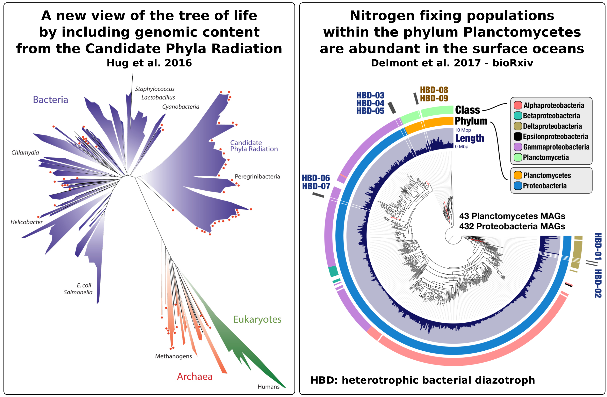
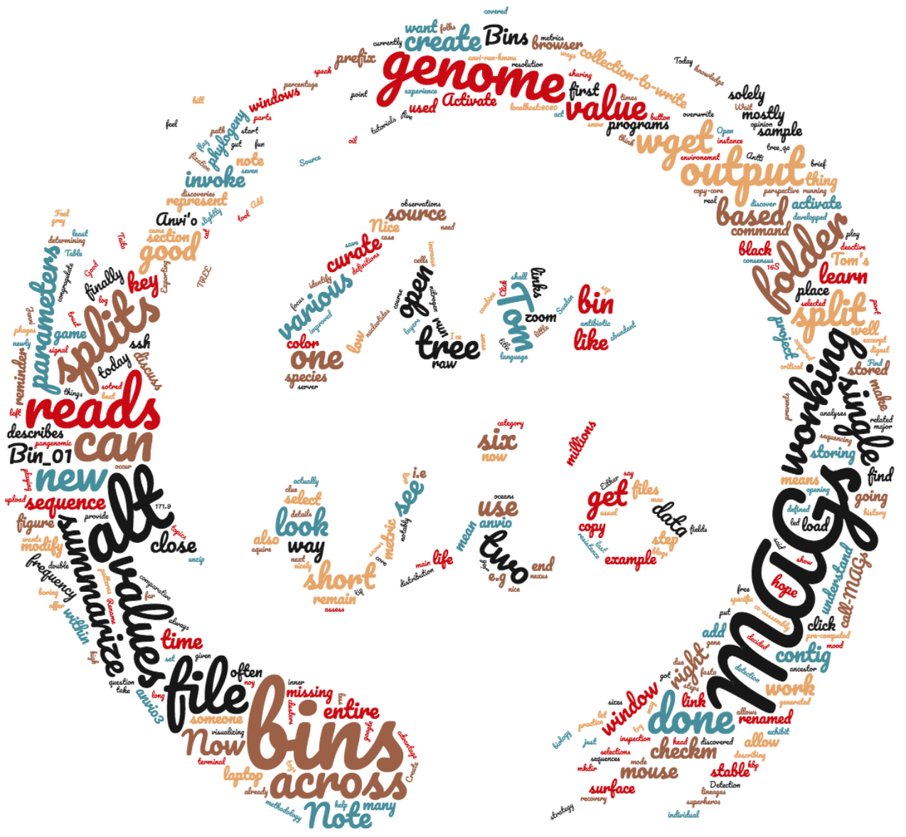
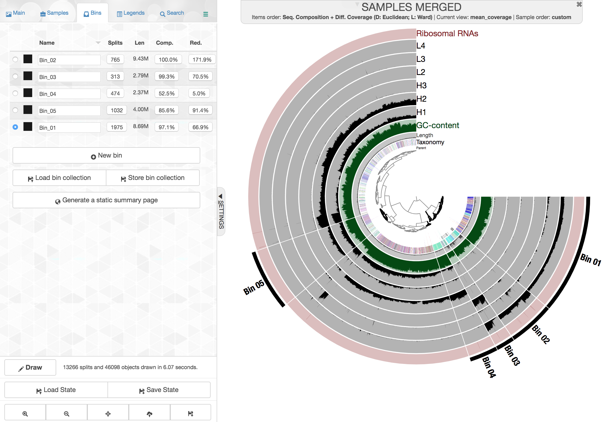
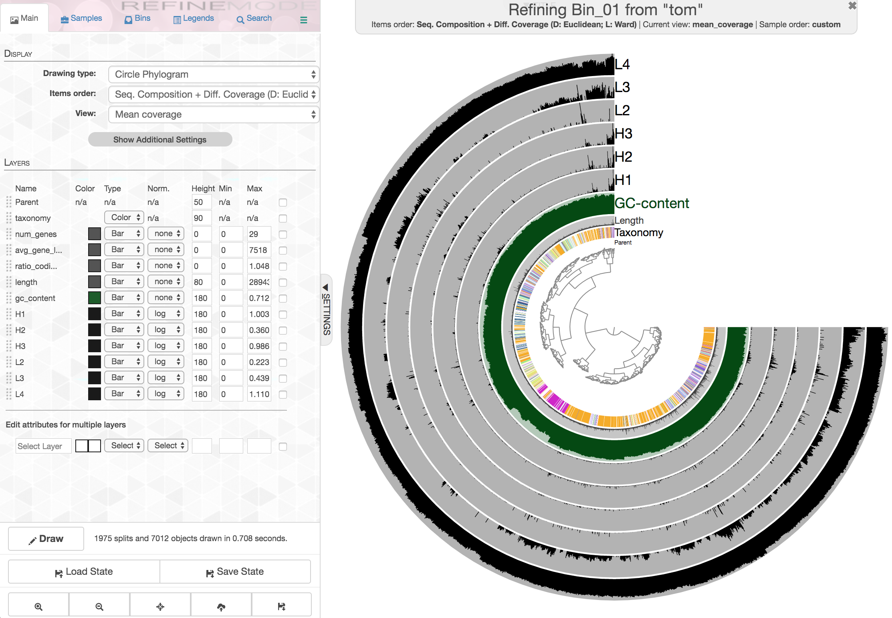
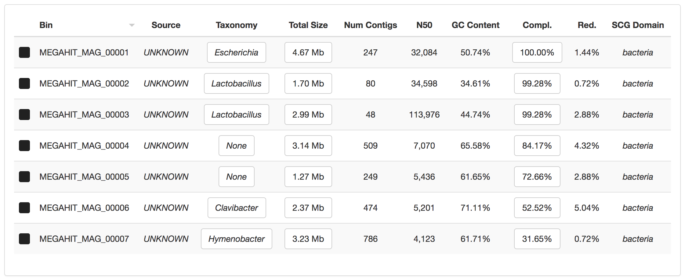
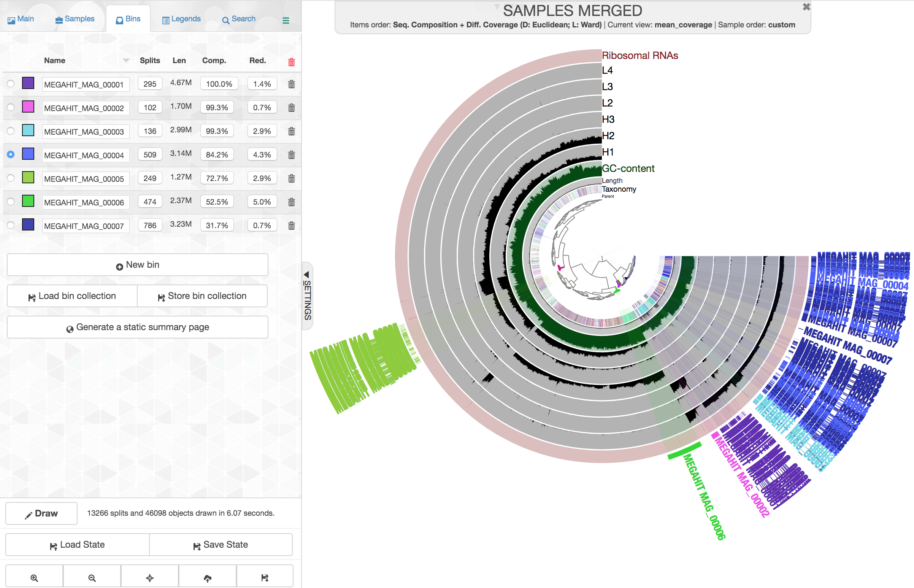
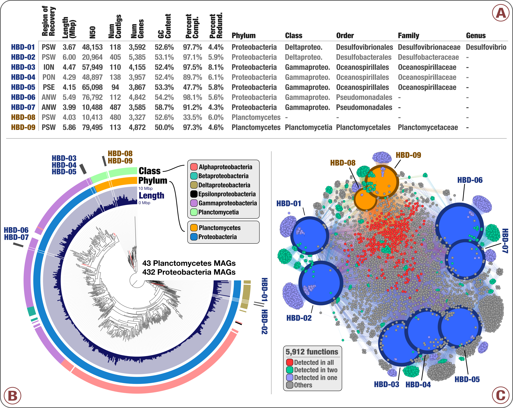

# Genome-resolved metagenomics

* Tom Delmont, Antti Karkman, Jenni Hultman *

This tutorial describes a way to extract and curate population genomes from millions of short metagenomic reads using a methodology called "genome-resolved metagenomics", or simply "binning".

This approach has led to major discoveries in the fields of evolutionary biology and microbial ecology. Here are two examples of what can be learned from the newly discovered genomes (topology of the tree of life on the left, nexus between phylogeny and nitrogen fixation in the surface of the oceans on the right):



And here is a world cloud of this tutorial, so you can see what we will speak about in a single look:



Here are a few definitions we came up with, so we can try to speak the same language today:

-**A microbial species**: Is this a real thing?

-**A microbial population**: pool of microbial cells sharing most of their genomic content due to a very close evolutionary history (close ancestor in the tree of life). 

-**A metagenome**: sequencing data corresponding to more than one genome. 

-**A metagenomic assembly**: set of DNA sequences called contigs that were reconstructed from metagenomic short reads.

-**A population genome**: consensus genomic content of a microbial population acquired using a metagenomic assembly.

-**Metagenomic binning**: the act of clustering contigs from a metagenomic assembly into "bins". Note that not all bins represent population genomes (e.g., phages, plasmids, and all the things we have very little clue about).

-**The platform anvi'o**: this place where microbiologists can finally feel they are bioinformatics superheros!

-**A CONTIGS.db**: anvi'o database storing various information regarding the metagenomic assembly output (the FASTA file)

-**A PROFILE.db**: anvi'o database storing various information regarding metagenomic reads the FASTA file recruited (note: this is the same fasta file used to generated the CONTIGS.db)

-**A split**: a section of a contig defined by length (for improved binning experience, we display multiple splits for very long contigs in the anvi'o interface).

-**A collection**: collection of bins sotred in the PROFILE.db (this simply links splits in the CONTIGS.db to bins)

-**The working environment**: Path in the server where you have all anvi'o files related to this project (it should contain the file `MEGAHIT_2500nt_CONTIGS.db` and the folder `SAMPLES-MERGED`)

So, we hope you are in a good mood to discover and characterize new genomes!

Today, we are going to use these programs within the platform anvi'o:

`anvi-interactive`
`anvi-import-collection`
`anvi-refine`
`anvi-summarize`
`anvi-rename-bins`

You can learn details for each anvi'o program using the `-h` flag. For example: `anvi-interactive -h`

Ok.

## 01- A reminder of what has been done until now

As you may remember, we have already done all of this:

- [x] Co-assembling six metagenomes corresponding to the gut of two species
- [x] Creating a CONTIGS database to make sense of the assembly output (find genes, get GC-content and tetra-nucleotide frequency of contigs)
- [x] Searching for single copy-core genes, and running COGs for functions / CARD for antibiotic resistance genes
- [x] Exporting genes stored in the CONTIGS database, determining their taxonomy and importing the results into the CONTIGS database
- [x] Recruiting short reads from each metagenome using the co-assembly output
- [x] Creating PROFILE databases from the recruited reads, and merging them into a single PROFILE database
- [x] beat Sweden in Sweden for the 

In case someone is missing some of the steps, this command will allow you to download the entire directory of anvi'o files for this project (this is a back-up for the workshop, but also a good starting point for someone that just wants to practice binning with anvi'o):

```
wget https://www.dropbox.com/s/xusxf63iykiewbs/00_MEGAHIT-Binning-v3.zip?dl=0
mv 00_MEGAHIT-Binning-v3.zip?dl=0 00_MEGAHIT-Binning-v3.zip
unzip 00_MEGAHIT-Binning-v3.zip
```

Well, I think that's it, right? **Now it is time for the fun part of visualizing and manipulating raw genome-resolved metagenomic results using the anvi'o interactive interface**.

Ha, a last thing: Tom would like to congragulate you for beating Sueden in Sweden during the 1995 Men's World Ice Hockey Championships. Well done Finland!


## 02- Describing the interface

There are currently two programs to invoke the interactive interface. We will first use this one: `anvi-interactive`. It basically will let you combine and visualize all the data stored in your CONTIGS and PROFILE databases.

Open a new ssh window. In mac:

```
ssh -L 8080:localhost:8080 YOUR_USERNAME@taito.csc.fi
```

in Windows with Putty:
In SSH category [+] select "tunnels". Add

Source port: 8080 
Destination: localhost:8080

Click add and log in to Taito as usual.

Activate anvio virtual environemnt `source activate anvio3`  
and go to the Anvi'o folder in the course folder at `$WRKDIR`.  

```
anvi-interactive -c MEGAHIT_2500nt_CONTIGS.db -p SAMPLES-MERGED/PROFILE.db --server-only -P 8080
```

Then open google chrome and go to address 

http://localhost:8080

So far, so good?

>Please note that if you work from your laptop, please do not add `--server-only -P 8080`, as it prevents the opening of the window in the browser.

## 03- Describing the interface

Basically, **the interface allows you to manipulate various parameters**, zoom in and out in the display and learn names/values using the mouse, save/load your work, and summarize your binning results.

Overwhelmed by the interface? Here is a brief explanation to help digest this new environment:


We hope that by the end of the day all of you will be familiar with the interface.

## 04- A first look at the display

**Clicking on the "Draw" button will show the raw display**. The display describes 13,010 contigs organized into 13,266 splits of 40 kbp or less, along with their mean coverage values across the six metagenomes and other relevant metadata (GC-content and taxonomy of splits especially).

Here is what you should see:


Here is the key part to remember: **the six grey layers correspond to the mean coverage values in the six metagenomes**. For each split, a black color means there is environmental signal. No black color means the split did not recruit any reads.

In addition to the main display, there is a second layer of information describing high-resolution coverage values of contigs across metagenomes. To see it, please put your mouse on a split in the display, and right click to select the `inspection` mode, which should open a new window. Let's do it for a few splits, and discuss the observations.

Nice.

## 05- Manipulating the inner tree

Let's play with the different contig clustering options:


It is important to understand what they are based on. This knowledge will be key for the manual binning, and curation of population genomes in downstream analyses.

-**Differential coverage**: clustering solely based on the differential coverage of contigs across the samples. This metric is often stable across a genome, and will be different between genomes that do not have the same distribution patterns in the dataset.

-**Sequence composition**: clustering solely based on sequence composition (the tetra-nucleotide frequency) of contigs. This metric is often stable across a genome, and different between genomes from different lineages.

-**Differential coverage and sequence composition**: clustering using the two metrics for optimal binning resolution

Note: as a strategy, the anvi'o developers decided to trust the assembly, so splits from the same contig will remain together.

## 06- Binning the co-asssembly output (from individual contigs to bins) 

We are going to zoom in and out, and use the mouse to make selections of split clusters, using the clustering based on `differential coverage` and `sequence composition`.

The game is to find as many bins with high completion value, and low redundancy value. 

To save some time, we will focus on a subset of the data (Tom has done the entire binning and found out that other parts did not allow the recovery of population genomes. That being said, anyone is welcome to perform the entire binning another day!).

Please close the windows of the interface, and kill the job in the terminal using `control + c`. 

We offer two ways to aquire Tom's binning collection:

1- **From Github**: Please (1) download the collection called `collection-TOM_5_BINS.txt` from the Github (https://github.com/INNUENDOCON/MicrobialGenomeMetagenomeCourse/tree/master/ANVIO_COLLECTIONS) and upload it in your working environment (reminder: this is the path where you have the CONTIGS.db `$WRKDIR/BioInfo_course/Anvio`)

2- **Using wget with a dropbox link**: please run from your working environment:

```
wget https://www.dropbox.com/s/9fc5lsj3vk1ds2v/collection-TOM_5_BINS.txt?dl=0
mv collection-TOM_5_BINS.txt?dl=0 collection-TOM_5_BINS.txt
```

to create the file `collection-TOM_5_BINS.txt`.

Either way (Github vs wget), you can then import this information into the PROFILE.db (program is called `anvi-import-collection`), and visualize it in the interface:

```
anvi-import-collection -c MEGAHIT_2500nt_CONTIGS.db  -p SAMPLES-MERGED/PROFILE.db -C TOM_5_BINS collection-TOM_5_BINS.txt
```

Then please invoke the interface once again:

```
anvi-interactive -c MEGAHIT_2500nt_CONTIGS.db -p SAMPLES-MERGED/PROFILE.db --server-only -P 8080
```

And go to the "Bins" section of the interface to load the bin collection called `TOM_5_BINS`. You should then see this after drawing the figure:



>Note: Feel free to take a look at the `collection-TOM_5_BINS.txt` file to understand what it is (e.g., using `head collection-TOM_5_BINS.txt -n 10`). It simply links splits to Bins. Easy.

Ok.

These five bins exhibit different sizes and completion/redundancy values. For instance, the `Bin_01` has a length of 8.69 Mpb with a completion of 100% and a redundancy of 171.9%. This bin is mostly detected in the sample `L4`, and slightly detected in the sample `L3`.

Wait, how do we assess the completion and redundancy values again?
Good question folks.

This is thanks to the program called `anvi-run-hmms`, which searched for single copy core genes that should occur once in each microbial genome. Let's say there are 100 of these genes. If all of them are detected once in the selected cluster (i.e., the bin), then the completion is 100% and the redundancy is 0%. If a few genes are detected multiple times, the redundancy value will increase. If a few genes are missing, then it is the completion value that will drop.

Ok.

Now, let's refine each one of them using the program `anvi-refine` (this is the second way to invoke the interface; it is mostly used to work on a single bin within a collection).

We shall start with the `Bin_01`:

```
anvi-refine -c MEGAHIT_2500nt_CONTIGS.db  -p SAMPLES-MERGED/PROFILE.db -C TOM_5_BINS -b Bin_01 --server-only -P 8080
```

Which should load this figure:




It is actually a good example. Let's refine it together.

When done, we will do the same for the bins 02, 03, 04 and 05, and finally summarize our results:

```
anvi-summarize -c MEGAHIT_2500nt_CONTIGS.db -p SAMPLES-MERGED/PROFILE.db -C TOM_5_BINS -o SUMMARY_BINNING
```

This step create a folder called `SUMMARY_BINNING`. Please download this folder into your laptop using `scp`, open it and double click on the file called `index.html`. This should open a windows in your browser.

Ok.

If some of the bins remain with redundancy value >10%, please refine them again, and summarize once again (SUMMARY_BINNING-2 as anvi'o does not want to overwrite the folder SUMMARY_BINNING). The game is to have all bins with redundancy <10%.

OK! Now we have bins with low redundancy values, and some of them look like they represent population genomes!

Cool. 

## 07- Rename the collection of bins and identify population genomes

Create a new collection where bins are nicely renamed, and MAGs identified (MAG = metagenome-assembled genome = population genome)

```
anvi-rename-bins -c MEGAHIT_2500nt_CONTIGS.db -p SAMPLES-MERGED/PROFILE.db --collection-to-read TOM_5_BINS --collection-to-write MAGs --call-MAGs --prefix MEGAHIT --use-highest-completion-score --report-file REPORT
```

Bins >2 Mbp and those with a completion >70% will be renamed as MAGs (i.e., as population genomes).

>Note that these parameters can be modified by playing with parameters of the program (see `anvi-rename-bins -h`) 

And summarize the collection:

```
anvi-summarize -c MEGAHIT_2500nt_CONTIGS.db -p SAMPLES-MERGED/PROFILE.db -C MAGs -o SUMMARY_MAGs
```

So, how many MAGs did you get???

## 08- Don't forget to curate each population genome!


Now is the time for some genomic curation. This step is boring, but critical: we need to manually curate each one of the MAGs using the `anvi-refine` command line:
 
```
anvi-refine -c MEGAHIT_2500nt_CONTIGS.db -p SAMPLES-MERGED/PROFILE.db -C MAGs -b MEGAHIT_MAG_000001  --server-only -P 8080
```

and so one for all MAGs. After that, we will create a final collection called `MAGs_FINAL`:

```
anvi-rename-bins -c MEGAHIT_2500nt_CONTIGS.db -p SAMPLES-MERGED/PROFILE.db --collection-to-read MAGs --collection-to-write MAGs_FINAL --call-MAGs --prefix MEGAHIT --use-highest-completion-score --report-file REPORT
```

and summarize the final, curated collection:

```
anvi-summarize -c MEGAHIT_2500nt_CONTIGS.db -p SAMPLES-MERGED/PROFILE.db -C MAGs_FINAL -o SUMMARY_MAGs_FINAL
```

We are done with the binning and the curation of this metagenomic co-assembly output!

Tom got seven bacterial population genomes. What did you get?

Here is the end product for Tom:



And this is the perspective of these MAGs in the interface:



We should discuss why contigs from each MAG are not next to each other. This is a key advantage of the manual binning, and explains well why automatic binning as it is developped today is noy working well (Tom's opinion, at least).

PS: if you want, you can download the collection called `collection-TOM_only_MAGs_FINAL.txt` on the Github, import it into the PROFILE.db (program is called `anvi-import-collection`), and visualize it in the interface. Alternatively you can use `wget https://www.dropbox.com/s/k4b3acezmdlh30j/collection-TOM_only_MAGs_FINAL.txt?dl=0` and `mv collection-TOM_only_MAGs_FINAL.txt?dl=0 collection-TOM_only_MAGs_FINAL.txt`.

## 10- Exploring the summary output

Anvi'o produced a FASTA file for each MAG, along with various parameters regarding notably their environmental detection:

Here are values for each MAG that are particularly useful:

- [x] Mean coverage across metagenomes (how abundant a MAG is in a given metagenome)
- [x] Detection across genomes (percentage of the nucleotides covered by the recruited reads)
- [x] Table of genes and identified functions (tip: very useful when you have metatranscriptomes!)
- [x] All identified rRNAs (do we have a 16S rRNA gene?)

## 11- What do we do with these genomes?

Let's create a new directory called `Population_genomes` and copy the MAGs there:

```
mkdir Population_genomes
cp SUMMARY_MAGs_FINAL/bin_by_bin/*/*MAG*.fa Population_genomes
cd Population_genomes/
ls
```

OK.

Let's run CheckM from this directory now, and learn about the taxonomy of each MAG using this advanced tool:

```
# Deactivate the anvio environment
source deactive anvio3
# Activate the CheckM environment
source activate checkm
# Find the marker genes and place them in a pre-computed phylogenetic tree (please modify `PATH` accordingly to your working environment)
checkm tree PATH -x .fa -t 40 PATH/TREE
# Parsing marker genes and get taxonomy (again, please modify `PATH` accordingly to your working environment)
checkm tree_qa TREE -f OUTPUT.txt
```

Nice. let's look at the results:

```
cat OUTPUT.txt
```

Look are the nice E. coli! What about using the tools described on Monday, Tuesday and Wednesday (comparative genomics) to analyse this newly aquired genomes in the context of thousands of E. coli reference genomes?

This [link](http://137.205.70.78/main/dataset/share/35a7c758dc609752e3870191c0962c63c2067abc0f5adc52ddcd5df81e05c2667138e40179d715574c94073ea4313ed3272e5ef2089fb52a650182) brings you there. Enjoy the PHYLOVIZ online visualization properties now. 

## 12- Perspectives

With the type of data extracted from the metagenomes, it could be possible to perform nice "combo analyses". For instance, by combining taxonomy, phylogeny and functions like [in here](https://www.biorxiv.org/content/early/2017/04/23/129791):



We also provide tutorials for these specific topics:

- [x] [Working with (meta)transcriptomics data](http://merenlab.org/2015/06/10/combining-omics-data/)
- [x] [Analysing single nucleotide variants](http://merenlab.org/2015/07/20/analyzing-variability/)
- [x] [Describing the anvi'o metagenomic workflow](http://merenlab.org/2016/06/22/anvio-tutorial-v2/)
- [x] [Describing the anvi'o pangenomic workflow for comparative genomics](http://merenlab.org/2016/11/08/pangenomics-v2/)
- [x] [Editing figures anvi'o produces](http://merenlab.org/2016/10/27/high-resolution-figures/)

And blogs using anvi'o:
- [x] [Bacteria in the DeepWater Horizon oil plume](http://merenlab.org/2017/10/16/reply-to-probst-et-al/)
- [x] [Candidate Phyla Radiation in Human Blood](http://merenlab.org/2017/08/23/CPR-in-blood/)
- [x] [A thousand microbial genomes from the surface ocean](http://merenlab.org/2017/05/21/thousand-genomes-from-tara/)
- [x] [Inspecting the genomic link between Archaea and Eukarya](http://merenlab.org/2017/01/03/loki-the-link-archaea-eukaryota/)
